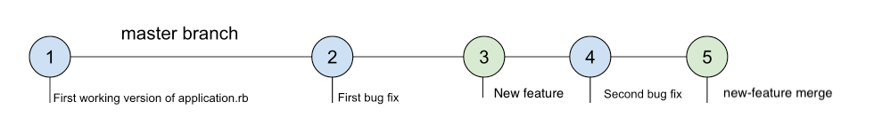

# Git Collaboration

```diff
- my overall notes & thoughts
+ the README is part tutorial, part lesson. It's got a lot of shifting goals.
+ needs more illustrative and concise examples to describe git. The documentation sort of uses "timelines" already as an analogy. 
+ the diagrams or graphs of branches are inconsistent and misleading.
+ too verbose at times. Sections should be simplified and pared-down. 
+ could benefit from a glossary of terms and git commands.
+ can't rewrite everything, need to solve the biggest problem which is an inconsistent and confusing example about merges.
```

```diff
- core concepts
+ local branches, master vs. others
+ working on separate branches
+ merging work into master branch
+ remote branches, how to fetch, merge and pull
```


## The Big Picture

`git` is powerful. So powerful, in fact, that it allows different people with different ideas to work on the same project. You could be the CTO of a global fleet of software engineers or someone with a couple of different ideas about a site for cat facts; `git` is the universal solution for any codebase that has multiple needs and ideas without sacrificing productivty.

The `git` feature that makes this all possible: `branches`. 

### So what do `branches` really do?

By making distinct working versions of a codebase, `branches` encourage engineers to make mistakes, experiment, and even collaborate with others on the same project -- which makes `git` a form of science, art, and self-defense. 


## Objectives

You should already be familiar with commits and basic commands like `git init`, `git add`, `git commit`, `git log`. If not, you should take some time to learn or review those first before continuing to read about the following objectives: 

1. [A common scenario](#A-common-scenario) 
2. [The `master` branch](#the-master-branch)
3. [The Golden Rule](#The-Golden-Rule)
4. [Create branches and checkout branches](#Create-branches-and-checkout-branches)
5. [Working in different branches](#Working-in-different-branches)
6. [Merging branches](#Merging-branches)
7. [Update branches from remotes with `git fetch`.]()
8. [Merge updated remote branches with `git merge`.]()
9. [Update and merge remote branches with `git pull`.]()

## A common scenario

Consider the following scenario.

We start work on a big new feature, making a few commits that don't entirely finish the feature leaving it half-working, or completely broken as some would say. Here's what happens though. We suddenly notice a big unrelated bug that is currently breaking the application for all users. So we take a break from working on the new feature to fix the bug. Your `git log` might look like this:

```
r4212d1 Fix to application breaking bug (aviflombaum, just now)
512bec5 Still broken, working on new-feature (aviflombaum, 2 hours ago)
62d840 Almost done with new-feature (aviflombaum, 1 day ago)
fbee832 Started new-feature (aviflombaum, 2 days ago)
```

See the dilemma? We can't deploy to production, because our fix commit is connected to the broken feature commits. That's no good. We need the ability to work on new features and bug fixes independently. 

`git` solves this dilemma by keeping `branches`, discrete and individual lines of work, isolated from each other. Now let's demonstrate how.


## The `master` branch

If you've ever made a `git` repo, you've used the `master` branch before. Though the name sounds intimidating, `master` is just the default name of our main line of work. Every `git` repo has one. We'll show you.

Let's begin a new application. We'll create a directory `mission-critical-application` and initialize a repo in the directory.

```
~ $ mkdir mission-critical-application
~ $ cd mission-critical-application
mission-critical-application $ git init
```

We'll then create our first version of the app by creating the file `application.rb` and committing it.

```
mission-critical-application $ touch application.rb
mission-critical-application $ git add application.rb
mission-critical-application $ git commit -m "First working version of application.rb"
```

We'll also make our first bug fix.

```
mission-critical-application $ touch first-bug-fix.rb
mission-critical-application $ git add first-bug-fix.rb
mission-critical-application $ git commit -m "First bug fix"
```

But what about the `master` branch? Shouldn't we make it? You're already on it. `git status` will always tell you what branch you are on.

```
mission-critical-application $ git status
On branch master
nothing to commit, working directory clean
```

Right now our `git log` could be visualized as a timeline composed of two commits. 


Whenever you are working on commits in git, you are adding them on a timeline of code called a branch. The branch you are on by default at the start of any repository, your main timeline, the main branch is called `master`. The command `git init` create it for you. 


## The Golden Rule

The `master` git branch is our default branch. As a rule, software engineers make sure that the `master` branch is always clean with working code. We only commit fixes and complete features so that we can always deploy `master`.

The rule is an agreement that `master` should always be the official working version of our app.


## Create branches and checkout branches

### `git branch`

To keep master clean, when we want to start a new feature, we should do it in an isolated feature branch. To make a new branch simply type: `git branch <branch name>`. In the case of a branch relating to a new feature, we'll name the branch `new-feature` like so:

```
mission-critical-application $ git branch new-feature
```

To see a list of our branches we can type: `git branch -a`

```
mission-critical-application $ git branch -a
* master
  new-feature
```

As expected, we have a branch called `master` and another called `new-feature`. And as of right now, both branches are identical in code. It's clicking the "Save As..." button on your word document; you've made a new version but with the exact same content inside. 

The `*` in front of the branch `master` indicates the branch we're currently working on (`git status` does the same). If we made a commit right now, that commit would only be applied to our `master` branch. We are free to make changes to one branch without affecting the other.

### `git checkout`

To switch teh branch we're working on, we use  `git checkout <branch name>`. 

```
mission-critical-application $ git checkout new-feature
Switched to branch 'new-feature'
mission-critical-application $ git branch -a
* new-feature
  master
  ```

**Protip: You can create and checkout a new branch in one command using: `git checkout -b new-branch-name`. That will both create the branch `new-branch-name` and move into it by checking it out.**

## Working in different branches

We started on `master` and then checked out our `new-feature` branch with `git checkout new-feature`, thereby moving into that timeline.

Let's make a commit in this `new-feature` and get the feature started by making a new file, `new-feature-file` to represent the code for the new feature.

```
mission-critical-application $ touch new-feature-file
mission-critical-application $ git add new-feature-file
mission-critical-application $ git commit -m "New feature"
[new-feature 332a618] New feature
 1 file changed, 0 insertions(+), 0 deletions(-)
 create mode 100644 new-feature-file
```

You can see the commit we made was made in the context of the `new-feature` branch. So what happens to the `new-feature-file` if we move back to the `master` branch? 

```
mission-critical-application $ git checkout master
Switched to branch 'master'
mission-critical-application $ ls
application.rb first-bug-fix.rb
```

The `new-feature-file` is gone! Why? Because we commited out work in different branch, or timeline. The `new-feature-file` only exists in a commit that resides in the the `new-feature` branch. This graph shows what happens when you `checkout` a different branch: you only see the code that exists in that timeline. 


Now that we're on `master` again, let's commit a new file, `second-bug-fix.rb`.

```
mission-critical-application $ touch second-bug-fix.rb
mission-critical-application $ git add second-bug-fix.rb
mission-critical-application $ git commit -m "Second bug fix"
```

Let's look at our series of branches and timelines now.


Notice the *branching* tree like structure in the graph -- how the timelines begin to split. You could describe `master` as being 1 commit ahead of the `new-feature` branch because it doesn't have the second bug fix commit. 


## Merging branches

Let's say our new feature is ready after just one commit. Our goal is to then bring the timeline of commits that occurred on the `new-feature` branch into the `master` branch so that at the end of the operation, our `master` timeline looks effectively like:



By merging the timelines, `master` will have all of the commits from the `new-feature` branch. The 5th commit you see at the end of the timeline will be auto-created when we merge.  

When we merge a branch, it's important to be currently working on your target branch, the branch you want to the commits to end up in. The first step for our `new-feature` merge is to checkout `master`.

```
mission-critical-application $ git checkout master
Switched to branch 'master'
```

### `git merge`

Once on your target branch, type: `git merge <branch name> -m <commit message>` where `<branch name>` is the branch we want to pull in commits from. It will create another commit to record the merge, which you should describe with a message.  

```
mission-critical-application $ git merge new-feature -m "new-feature merge"
Updating e5830af..bfe50fc
Fast-forward
 new-feature-file      | 0
 1 file changed, 0 insertions(+), 0 deletions(-)
 create mode 100644 new-feature
```

Now the branches have been merged and if you `ls`, you'll see the `new-feature-file` from the `new-feature` branch in your current working directory that is checked out to `master`.

The timelines have been merged into master. And all is well. We can deploy our bug fixes and the new feature to production. 

## Working with remote branches with `git fetch` and `git pull`


```diff
- notes on this section
+ where did this remote repo come from? How do readers who are following the commandline steps fetch a remote repo they haven't added? What if the permissions change?
+ The tutorial part falls apart here. Maybe focus on the conceptual understanding instead. 
+ this example gets too lost in the weeds. Clarity is more important than pointing out every detail.
```

Your local branches can attach to remote branches that live on the internet, generally on GitHub, that your team members might contribute to and you can download locally.

Whenever you want to update your local copy with all the branches that might have been added to the GitHub remote, you can type `git fetch`.

```
mission-critical-application $ git fetch
remote: Counting objects: 4, done.
remote: Compressing objects: 100% (2/2), done.
remote: Total 4 (delta 3), reused 3 (delta 2), pack-reused 0
Unpacking objects: 100% (4/4), done.
From github.com:aviflombaum/mission-critical-application
   bfe50fc..0ae1da2  master     -> origin/master
 * [new branch]      remote-feature-branch -> origin/remote-feature-branch
```

From within `master` (though technically what branch I was in when I typed `git fetch` does not matter), I executed `git fetch`. The last 3 lines of output are really important, let's take a closer look:

```
From github.com:aviflombaum/mission-critical-application
   bfe50fc..0ae1da2  master     -> origin/master
 * [new branch]      remote-feature-branch -> origin/remote-feature-branch
```

The first line, `From github.com:aviflombaum/mission-critical-application` is informing us which remote our `git fetch` updated from, namely, the remote repository located at: https://github.com/aviflombaum/mission-critical-application

When we `fetch` with git, we are asking to copy all changes on the remote to our local git repository, but not actually integrate any. The next line, `bfe50fc..0ae1da2  master     -> origin/master` is telling us that a new commit was found in `origin/master`. `origin/master` means the GitHub version of `master`. Even though git fetched a new commit from `origin/master`, it did not merge it into the local master.


Our remote copy on GitHub has a file, `remote-bug-fix`, presumably some code that another developer pushed up to our remote version of the `master` branch to fix a bug. Even after we fetched, our local copy still doesn't appear to have that file.

After you fetch, you have access to the remote code but you still have to merge it. How do you merge a change fetched from `origin/master` into your current master? From within your local master branch, type: `git merge origin/master`, referring to the branch's full path, `remote/branch`, or `origin/master`.

```
mission-critical-application $ git merge origin/master
Updating bfe50fc..0ae1da2
Fast-forward
 remote-bug-fix | 0
 1 file changed, 0 insertions(+), 0 deletions(-)
 create mode 100644 remote-bug-fix
mission-critical-application $ ls
 application.rb		new-feature-file    new-feature		
 remote-bug-fix
```

The commits fetched via `git fetch` are now merged from the `origin/master` branch into our local `master` branch. And now `ls` reveals that the file present on the remote, `remote-bug-fix` is integrated into our local copy of `master` as well.

When we fetched, git also outputted: `* [new branch]      remote-feature-branch -> origin/remote-feature-branch`. Similarly, git fetched a new branch and if we want to check it out or merge it we can using `git checkout` or `git merge`. Let's checkout what code is on `remote-feature-branch`, a branch another developer made for another feature and pushed up to GitHub so they can share it with us.

```
mission-critical-application $ git checkout remote-feature-branch
Branch remote-feature-branch set up to track remote branch remote-feature-branch from origin.
Switched to a new branch 'remote-feature-branch'
```

When we checkout a remote branch fetched, git will create a local branch to track that remote and switch to that branch. We can now do work, push it back up to GitHub, and another developer can fetch those changes down.

`git fetch` is a pretty low-level git command we don't use that much because it always requires two steps, first `git fetch` and then `git merge` to actually integrate those changes into your working branch. Generally, if you are in `master` you want to immediately `fetch` and `merge` any changes to the remote master.

### Combining `git fetch` with `git merge` by using `git pull`

If you want to both fetch and merge, which is what you want to do 99% of the time, just type `git pull`. `git pull` is literally the combination of both `git fetch` and `git merge`.

When you `git pull` the following things will occur:

1. You will `git fetch` all remote changes, including those on the current branch, existing branches, and new branches.
2. Any changes that are on a remote branch which is being tracked by your local branch, that is to say, if you are on `master` and there is a change to `origin/master`, those changes will be automatically merged.

## Conclusion

```diff
- notes on this section
+ the conclusion begets a quick summary of the important takeaways.
+ it's good that we remind the reader that implementation is difficult and takes practice. Hopefully, conceptual understanding has begun. 
+ always a relevant xkcd.
```

Git is complex, and collaborating with people in this matter is just hard - there's no easy way to allow 100s of people to all work on the same code base. These workflows are just being introduced to you.  You'll have lots of time to practice them and memorize what each command does. Don't try to learn it all at once; instead just start to get an understanding of what's what.


<a href='https://learn.co/lessons/git-collaboration-readme' data-visibility='hidden'>View this lesson on Learn.co</a>

<p data-visibility='hidden'>View <a href='https://learn.co/lessons/git-collaboration-readme'>Git Collaboration</a> on Learn.co and start learning to code for free.</p>

<p class='util--hide'>View <a href='https://learn.co/lessons/git-collaboration-readme'>Git Collaboration</a> on Learn.co and start learning to code for free.</p>
